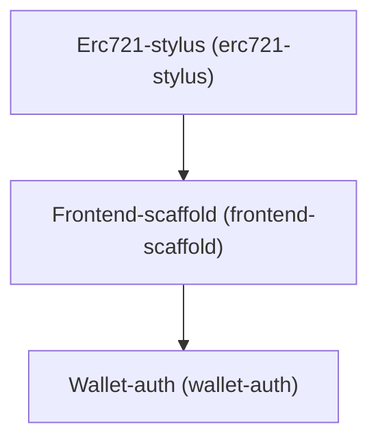

# Architecture

## Dependency Graph

```mermaid
graph TD
  fc5d232e["Erc721-stylus (erc721-stylus)"]
  b3d0eeb8["Frontend-scaffold (frontend-scaffold)"]
  b2dbd482["Wallet-auth (wallet-auth)"]
  b3d0eeb8 --> b2dbd482
  fc5d232e --> b3d0eeb8
```

## Execution / Implementation Order

1. **Erc721-stylus** (`fc5d232e`)
2. **Frontend-scaffold** (`b3d0eeb8`)
3. **Wallet-auth** (`b2dbd482`)
